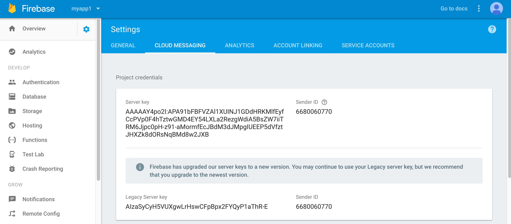

# BlueIntegrate

A sample project to show the easiness of integrating Bluemix Push service, Mobile Analytics and AppID service across different platform (mobile and web).

## Requirements
#### For Web
* Chrome(56)/Firefox(51)
* [Cloud Foundry or Bluemix CLI](https://console.bluemix.net/docs/cli/index.html)

#### For iOS
* iOS 8.0+
* Xcode 8.+
* Swift 3.+
* Cocoapods


## Setup Bluemix Services.

Complete the steps:

1. Create a [Push Notifications Service](https://console.ng.bluemix.net/catalog/?taxonomyNavigation=apps&category=mobile).

2. Create an [AppID Service](https://console.ng.bluemix.net/catalog/?taxonomyNavigation=apps&category=mobile)

3. Create a [Mobile Anlytics Service](https://console.ng.bluemix.net/catalog/?taxonomyNavigation=apps&category=mobile).

**Note:** For service credentials, click on Credentials tab on the left pane.


## Samples

Clone the ICLab-OmniChannelAppDev repo 

```
git clone https://github.com/ibm-bluemix-omnichannel-iclabs/ICLab-OmniChannelAppDev.git
```

### Web Sample


1. Go to https://console.firebase.google.com/ and Add a Project. 
Under **settings** Icon next to `Overview`, Click on `CLOUD MESSAGING` section to get Legacy Server key and Sender ID.

    
    
**Note:** Keep this tab open on your browser for future reference.
Go to the `ICLab-OmniChannelAppDev/Web` in your cloned repo and follow the below steps,

2. Go to the `Web/manifest.yml` file. Change the `host` and `name` to a unique name of your choice and add the `APP ID` service name you created above.


3. Open `views/protected.ejs` file, under `<script>` tag, add the code below

  ```

  var initParams = {
      "appGUID":"<Push Service APPGUID>",
      "appRegion":"<Push Service Region>",
      "clientSecret":"<Push service clientSecret>"
    }


  var appName = "<Analytics Service Name>";
  var apiKey = "<Analytics service API Key>";
  var hasUserContext=true; 
  var tenantId = "<Analytics Service tenantID>";
  BMSAnalytics.Client.initialize(BMSAnalytics.Client.REGION_US_SOUTH);

  
  ```
Add the appropriate service credentials by navigating to Bluemix.net.

4.  If you don't see bmsanalytics.js, BMSPushSDK.js, BMSPushServiceWorker.js and manifest.json file under /Web/views folder. Download these Push Service website SDKs from [Push Web SDK](https://github.com/ibm-bluemix-mobile-services/bms-clientsdk-javascript-webpush), [Ananlytics SDK](https://github.com/ibm-bluemix-mobile-services/bms-clientsdk-web-analytics) and paste them inside /web/views folder

5. Open the `views/manifest.json` file and add values for name and `gcm_sender_id (Sender ID)`.

6. Push to Bluemix using Bluemix CLI,

      1. Go to the folder Web in your terminal.
      2. Run the CLI command - cf api api.stage1.ng.bluemix.net ,
      3. Login to Bluemix from CLI using cf login. Select your Organization and Space.
      4. Do the cf push. This will host your app in Bluemix.
      5. After App is started open - https://yourwebsitename.mybluemix.net.

7. Open the `Bluemix Push service` and add the `websites address` and `Google server Keys (Legacy Server key)`.


#### Run the Web app

  Click on the Enable push button and it will register your website to Push notifications service. Later you can send push notifications from Push Service Dashboard.

#### Send Push Notifications

 Send Push notifications web application.

1. Got to the Push Service Dashboard and send message

2. You can see the notification in `Browser (Chrome and Firefox)`


### Mobile Sample

 Go to the ICLab-OmniChannelAppDev/iOS in your cloned repo and open the Podfile

1. Add the following pod dependencies

  ```
  target 'BMDService' do
        use_frameworks!
        pod 'BluemixAppID', :git => 'https://github.com/ibm-bluemix-mobile-services/appid-clientsdk-swift.git', :branch => ‘development’
        pod 'BMSPush'
        pod 'BMSAnalytics'
  end

  ```
2.	Do the `pod install` in your Terminal app inside the iOS.

3.	Open the `BMDService.xcworkspace` app in Xcode

4.	Add your `Bundle identifier` and configure for `push service`. Follow [this](https://console.
.ng.bluemix.net/docs/services/mobilepush/t__main_push_config_provider.html#create-push-credentials-apns)

5.	Enable `Push Notification`, `Background mode -> Remote notifications` and `Keychain Sharing`

6.	Go to the `Targets -> Info` and add `URL Types`. Set values for both `Identifier` and `URL Schemes` as `$(PRODUCT_BUNDLE_IDENTIFIER)`

7. Open `AppDelegate.swift` file and add values for the following,

  ```
       let appIdTenantId = "ClientId of your APPID Service"
       let appRegion = "your service region"
       let pushAPPGUID = "App Guid of your Push Notification Service"
       let pushClientSecret = "Client Secret of your Push Notification Service"
       let ananlyticsAppName = "BMDService"
       let ananlyticsApiKey = "API Key of your Mobile Analytics Service.”

  ```

8.	Initialize the `BMSCore`, `APPID` and `Analytics` SDKs inside `didFinishLaunchingWithOptions` method

9. Add the code to handle `APPID` call back function

  ```
  func application(_ application: UIApplication, open url: URL, options :[UIApplicationOpenURLOptionsKey : Any]) -> Bool {
          return AppID.sharedInstance.application(application, open: url, options: options)
  }
  ```

10. Create a method named `registerForPush` and initialize `BMSPush`

  ```
  func registerForPush() {

      BMSPushClient.sharedInstance.initializeWithAppGUID(appGUID: pushAPPGUID, clientSecret:pushClientSecret)
   }
  ```
11. Create another method `unRegisterForPush` and add the following code,

  ```
  func unRegisterForPush() {

           BMSPushClient.sharedInstance.unregisterDevice { (response, status, error) in

              if error.isEmpty {
                  print( "Response during unregistering device : \(response)")
                  print( "status code during unregistering device : \(status)")
                  UIApplication.shared.unregisterForRemoteNotifications()
              }
              else {
                  print( "Error during unregistering device \(error) ")

              }
          }
      }
  ```

12. Add code to register to Push Notification Service inside `didRegisterForRemoteNotificationsWithDeviceToken` method

  ```
  BMSPushClient.sharedInstance.registerWithDeviceToken(deviceToken: deviceToken) { (response, status, error) in

             if error.isEmpty {

                 print( "Response during device registration : \(response)")

                 print( "status code during device registration : \(status)")
                 self.showAlert(title: "Success!!!", message: "Response during device registration : \(response)" )
             }else{
                 print( "Error during device registration \(error) ")
                 self.showAlert(title: "Error!!!", message: "Error during device registration \(error)" )

             }
         }
  ```

13.	Add code to handle the Push Notification, inside `didReceiveRemoteNotification`

14.	Go to `LoginViewController.swift`  and add code to send the `Logger` and `Analytics` data to `Mobile Analytics service` . Provide the following code snippet inside `viewDidLoad` method

  ```
  let logger = Logger.logger(name: "My Logger")

        Logger.send(completionHandler: { (response: Response?, error: Error?) in
            if let response = response {
                print("Status code: \(response.statusCode)")
                print("Response: \(response.responseText)")
            }
            if let error = error {
                logger.error(message: "Failed to send logs. Error: \(error)")
            }
        })

        Analytics.send(completionHandler: { (response: Response?, error: Error?) in
            if let response = response {
                print("Status code: \(response.statusCode)")
                print("Response: \(response.responseText)")
            }
            if let error = error {
                logger.error(message: "Failed to send analytics. Error: \(error)")
            }
        })
  ```

15.	Inside `LoginViewController.swift` , add code for using `APPID Service` login. Add the code inside `log_inAppID` method.

  ```
  @IBAction func log_inAppID(_ sender: AnyObject) {

         loaderActivity.isHidden = false;
         //Invoking AppID login
         class delegate : AuthorizationDelegate {
             var view:UIViewController

             init(view:UIViewController) {
                 self.view = view
             }
             public func onAuthorizationSuccess(accessToken: AccessToken, identityToken: IdentityToken, response:Response?) {

                 let mainView  = UIApplication.shared.keyWindow?.rootViewController
                 let afterLoginView  = UIStoryboard(name: "Main", bundle: nil).instantiateViewController(withIdentifier: "ProfileViewController") as? ProfileViewController
                 afterLoginView?.accessToken = accessToken
                 afterLoginView?.idToken = identityToken
                 DispatchQueue.main.async {
                     mainView?.present(afterLoginView!, animated: true, completion: nil)
                 }
             }
             public func onAuthorizationCanceled() {
                 print("cancel")
             }

             public func onAuthorizationFailure(error: AuthorizationError) {
                 print(error)
             }
         }
         AppID.sharedInstance.loginWidget?.launch(delegate: delegate(view: self))
     }
  ```

16.	Run your iOS application

   * You can Register for push Notification using the Enable Push switch.

   * Use the Crash Your App switch to crash the app. This will store the crash report in Analytics and next time you open the app it will send crash report to the Mobile Analytics service.


#### Send Push Notifications

 Send Push notifications iOS application.

1. Got to the Push Service Dashboard and send message


2. You can see the notification in iOS device


### License

Copyright 2017-2018 IBM Corporation

Licensed under the [Apache License, Version 2.0 (the "License")](http://www.apache.org/licenses/LICENSE-2.0.html).

Unless required by applicable law or agreed to in writing, software distributed under the license is distributed on an "as is" basis, without warranties or conditions of any kind, either express or implied. See the license for the specific language governing permissions and limitations under the license.
